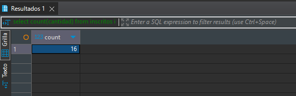
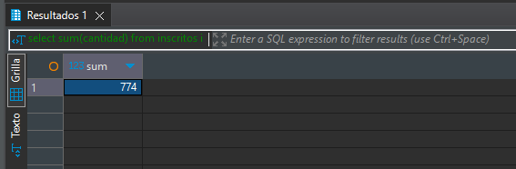
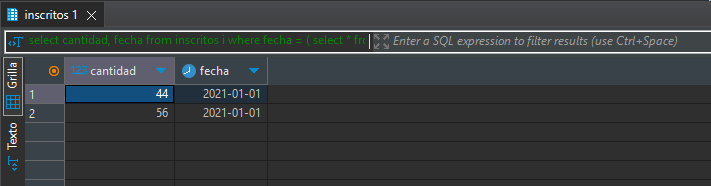
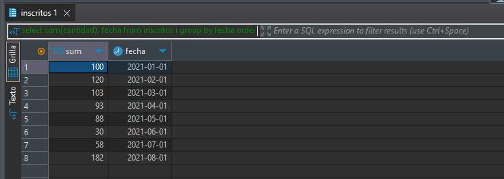
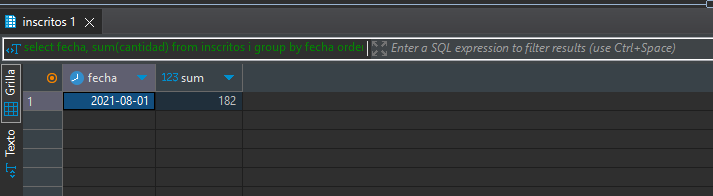

# **Desafío - Manipulación de datos y transaccionalidad en las operaciones.**
## *desarrollado por Marcelo Esparza Acuña*

## **Descripción**
Aplicando los conceptos y herramientas aprendidas hasta ahora, crea las querys SQL necesarias que contesten las siguientes preguntas.

### 1. ¿Cuántos registros hay?
```sql
select count(cantidad) from inscritos; 
```

>**Comentario:***
>*Para resolver este ejercicio, lo que se hice fue contar la cantidad de registros existentes en la tabla **inscritos** utilizando la función **count()***

### 2. ¿Cuántos inscritos hay en total?
```sql
select sum(cantidad) from inscritos;
```

>**Comentario:**
>*En este ejercicio lo que se buscaba era encontrar la sumatoria total de inscritos, para esto utilicé la función **sum()** en la*
>*consulta SQL, para sumar la cantidad total de inscritos.*

### 3. ¿Cuál o cuáles son los registros de mayor antigüedad?
```sql
select 
	cantidad, fecha
from inscritos  
where 
	fecha = (
		select * from (select min(fecha) from inscritos)
	);
```

>**Comentario:**
>*Para obtener los registros de mayor antiguedad, lo que hice fue obtener la totalidad de la data desde la tabla **inscritos** y mediante una subconsulta*
>*filtré la columna fecha utilizando la función **min()**, para obtener la fecha mas antigua.*

### ¿Cuántos inscritos hay por día? (entendiendo un día como una fecha distinta de ahora en adelante)
```sql
select 
	sum(cantidad), fecha
from 
	inscritos
group by
	fecha 
order by
	fecha asc ;
```

>**Comentario:**
>*Para resolver este ejercicio, la consulta sql suma la cantidad de usuarios a la vez que agrupa el resultado por fechas, con esta consulta obtengo*
>*un listado de cantidades agrupadas por fecha sin repetición, finalmente este resultado lo ordeno por fecha de forma* 
>*ascendente para tener un mejor orden en la visualización.*

### 5. ¿Qué día se inscribieron la mayor cantidad de personas y cuántas personas se inscribieron en ese día?
```sql
select 
	fecha, sum(cantidad) 
from 
	inscritos i
group by
	fecha 
order by
	sum(cantidad) desc 
limit 1;
```

>**comentario:**
>*La consulta SQL que utilicé es muy similar a la anterior, la diferencia para llegar al resultado ha sido cambiar el orden de visualización de las*
>*columnas (primero fecha y en segundo lugar la sumatoria de cantidades de inscritos, solo para mostrar un reporte mas ordenado acorde a la pregunta) y*
>*como en este caso se pide la mayor cantidad de personas, ordene el resultado por sumatoria de cantidad de inscritos de mayor a menor (orden*
>*descendente) dejando de esta forma la mayor cantidad de inscritos según fecha en la primera fila, luego solo me resto limitar el resultado a 1 fila*
>*para mostrar la informacón que se pide.*